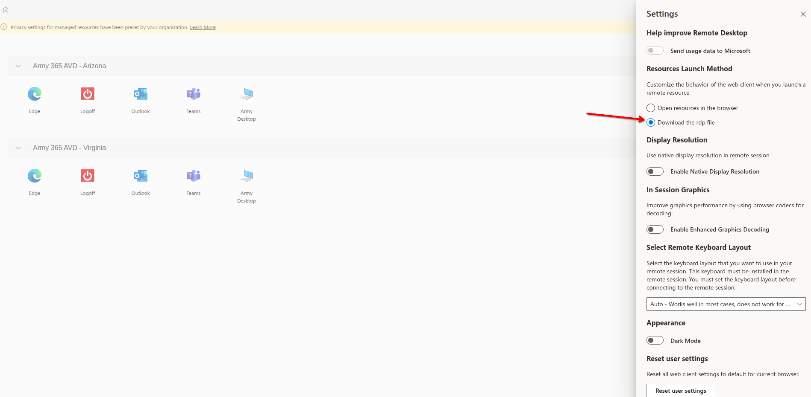
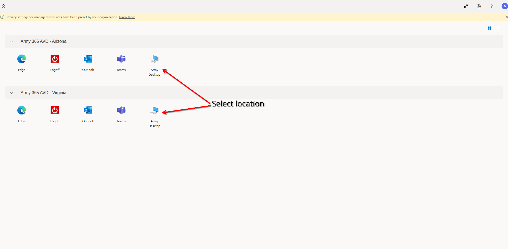
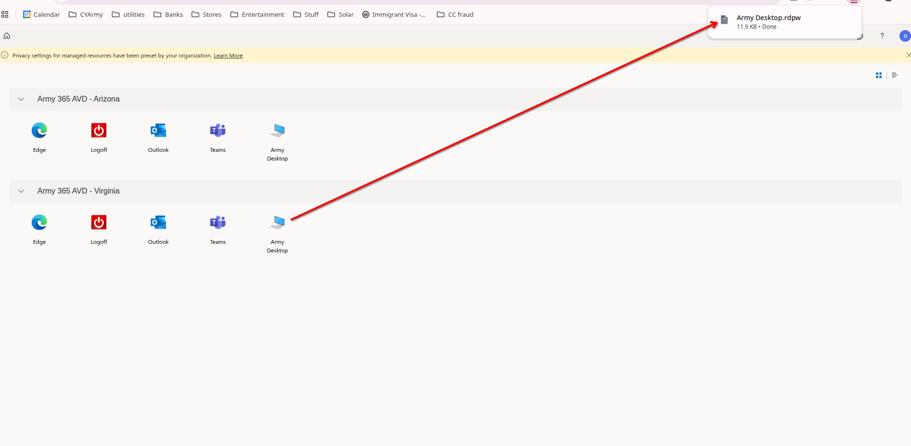
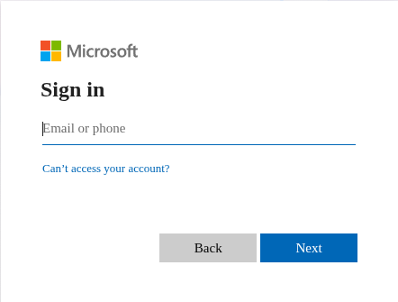
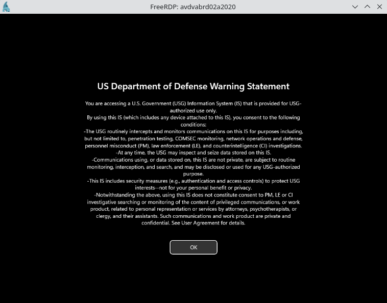

# AVD Python Package

A Python utility for establishing connections to Azure Virtual Desktop (AVD) environments on Linux.

## Overview

This package provides a wrapper for `xfreerdp` to seamlessly handle authentication, smart card routing, and session management when connecting to AVD, specifically optimized for Department of Defense (DoD) and Army environments.

## Prerequisites

Before using this tool, ensure your system has the following configured:

* **FreeRDP:** Properly installed `freerdp3-x11`.

* **Smart Card Middleware:** Proper drivers installed (e.g., `pcscd`, `opensc`) to read your CAC/Smart Card.

* **Connection File:** A valid AVD `.rdpw` configuration file.

> **Note:** Older 2.x versions of FreeRDP cannot handle Azure Virtual Desktop (AVD) connections because they lack the necessary Azure ARM gateway (/gateway:type:arm) and modern authentication protocols required to parse .rdpw files.

## Installation

Install the package directly using the provided wheel file:

For Ubuntu/Debian-based systems:
```bash
sudo apt update
sudo apt install freerdp3-x11
```
For Fedora-based systems:
```bash
sudo dnf install freerdp3-x11
```

Then:

```bash
python3 -m venv venv
source venv/bin/activate

# Upgrade pip and install your package / dependencies
pip install --upgrade pip
pip install .
playwright install
```

## Getting the RDP Configuration File

To use this utility, you first need to download your specific connection file from the [AVD web portal](https://rdweb.wvd.azure.us/arm/webclient/index.html).

1. **Configure Launch Settings:** Open your AVD portal **Settings** (usually a gear icon in the top right). Look for the "Resources Launch Method" section and select the **Download the rdp file** radio button.
   <br>

2. **Select Your Desktop:** Return to the main workspace screen. Click on the **Army Desktop** icon under your preferred region (e.g., Army 365 AVD - Arizona or Virginia).
   <br>

3. **Save the File:** A file typically named `Army Desktop.rdpw` will download to your local machine. Take note of where this file is saved (e.g., your `Downloads` folder), as you will need to provide this path to the CLI tool.
   <br>

## Usage

Start an AVD connection using the `start` command.

```bash
avd start -u <username> -loc <path_to_rdp_file>
```

### Options

* `-u, --username`: Your AVD connection username (required). This should be your official `Army.mil` email address.

* `-loc, --location`: Absolute or relative path to the AVD connection file you downloaded (default: `Army Desktop.rdpw`).

### Example

```bash
avd start -u john.doe@army.mil -loc "/home/user/Downloads/Army Desktop.rdpw"
```

## Authentication Flow

Once the command is executed, the tool will guide you through the standard DoD authentication sequence. Here is what to expect:

1. **Microsoft Sign-in:** You will first be prompted by Microsoft to enter your email.
   <br>

2. **Certificate Selection:** A dialog will appear asking you to select a certificate to authenticate yourself; choose your active DOD ID certificate.

3. **Security Device Unlock:** You must enter your Smart Card PIN to unlock the security device.

4. **Connection Consent:** Microsoft will ask you to confirm and allow the remote desktop connection to the specific AVD host.

5. **DoD Warning Statement:** Finally, the FreeRDP window will launch, presenting the standard US Department of Defense Warning Statement, which you must acknowledge by clicking "OK" to access your desktop.
   <br>

## Support

For technical questions, bug reports, or feature requests, please contact the repository maintainer or open an issue in the project tracker.